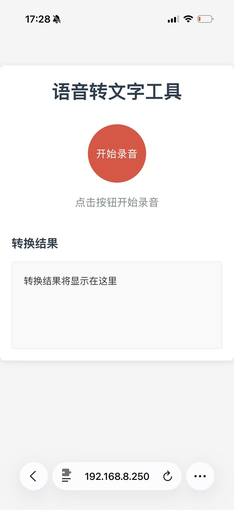

# 语音转文字应用 (Voice-to-Text Application)

一个基于Web的语音转文字工具，支持PC端和移动端，使用SiliconFlow API进行语音识别。

## 应用截图



## 功能特性

- 🎙️ 实时语音录制
- 📱 移动端支持（触摸事件优化）
- 🌐 多浏览器兼容
- 🔄 自动语音转文字
- 📝 清晰的转换结果展示
- 🔒 API密钥安全管理

## 技术栈

- **前端**：HTML5, CSS3, JavaScript
- **后端**：Python
- **API**：SiliconFlow Audio Transcriptions API
- **服务器**：
  - 传统HTTP服务器 (`start_server.py`)
  - FastAPI + uvicorn (`app.py`)

## 快速开始

### 前提条件

- Python 3.7+
- 已设置 `API_KEY` 环境变量（从SiliconFlow获取）

### 安装

1. 克隆仓库
   ```bash
   git clone https://github.com/GuokaiLiu/demo_simple_asr
   cd demo_simple_asr
   ```

2. 安装依赖（仅FastAPI方式需要）
   ```bash
   pip install fastapi uvicorn
   ```

### 运行

#### 方式1：使用传统HTTP服务器
```bash
python start_server.py
```

#### 方式2：使用FastAPI + uvicorn
```bash
uvicorn app:app --host 0.0.0.0 --port 8080
```

### 访问

在浏览器中打开：
- 本地访问：`http://localhost:8000`（传统服务器）或 `http://localhost:8080`（FastAPI）
- 网络访问：`http://<your-ip>:<port>`

## Caddy HTTPS配置

为了解决移动端浏览器的麦克风权限问题，建议使用Caddy设置HTTPS环境。详细步骤可参考：[CSDN博客](https://blog.csdn.net/qq_33039859/article/details/157687797?sharetype=blogdetail&sharerId=157687797&sharerefer=PC&sharesource=qq_33039859&spm=1011.2480.3001.8118)

### 多个端口的设置

⚠：相同应用需要不同的端口

**D:\Program Files\Caddy\Caddyfile** 配置示例：

```caddy
# Open-WebUI (访问地址 https://192.168.8.250:9997)
192.168.8.250:9998 {
    reverse_proxy localhost:9997
    tls internal
}

# ASR (访问地址 https://192.168.8.250:8000)
192.168.8.250:8001 {
    reverse_proxy localhost:8000
    tls internal
}
```

### 启动Caddy

```powershell
PS D:\Program Files\Caddy> .\caddy.exe run --config .\Caddyfile
```

### 访问HTTPS地址

配置完成后，使用以下地址访问：
- ASR应用：`https://<your-ip>:8001`（对应本地端口8000）

### 移动端访问注意事项

1. 下载并安装Caddy生成的根证书
2. 在iOS设置中信任该证书
3. 使用HTTPS地址访问应用

这样可以确保移动端浏览器正确授予麦克风权限。

## 使用方法

1. 点击「开始录音」按钮
2. 授权麦克风权限（首次使用时）
3. 开始说话
4. 点击「停止录音」按钮
5. 等待系统自动转换语音为文字
6. 查看转换结果

## 移动端使用

1. 确保手机和电脑在同一网络中
2. 在手机浏览器中访问电脑的IP地址和端口
3. 点击录音按钮，授权麦克风权限
4. 开始录音并转换

## 浏览器兼容性

- ✅ Chrome (PC & Mobile)
- ✅ Firefox
- ✅ Safari (PC & Mobile)
- ✅ Edge

## 常见问题

### Q: 点击开始录音没有反应
**A:** 请检查：
- 浏览器是否支持MediaRecorder API
- 是否已授权麦克风权限
- 是否在HTTPS环境或localhost中运行

### Q: 转换结果为空
**A:** 请检查：
- 网络连接是否稳定
- API_KEY是否正确设置
- 录音是否成功（是否有音频输入）

### Q: 移动端无法录音
**A:** 请检查：
- 手机浏览器是否支持录音功能
- 是否已授权麦克风权限
- 网络连接是否稳定

## 项目结构

```
demo_simple_asr/
├── index.html          # 前端界面
├── start_server.py     # 传统HTTP服务器
├── app.py              # FastAPI应用
├── .gitignore          # Git忽略文件
└── README.md           # 项目说明
```

## 配置

### API密钥设置

在系统环境变量中设置 `API_KEY`：

#### Windows
```cmd
set API_KEY=your_api_key_here
```

#### Linux/Mac
```bash
export API_KEY=your_api_key_here
```

## 注意事项

- 录音功能需要在安全上下文（HTTPS或localhost）中运行
- 移动端浏览器对麦克风权限有更严格的要求
- 音频文件大小和时长可能受API限制
- 网络连接质量会影响转换速度

## 许可证

MIT License

## 贡献

欢迎提交Issue和Pull Request！

## 联系方式

如有问题，请通过GitHub Issues联系。